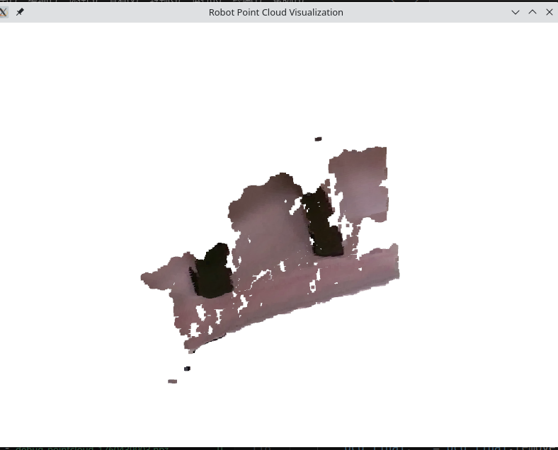
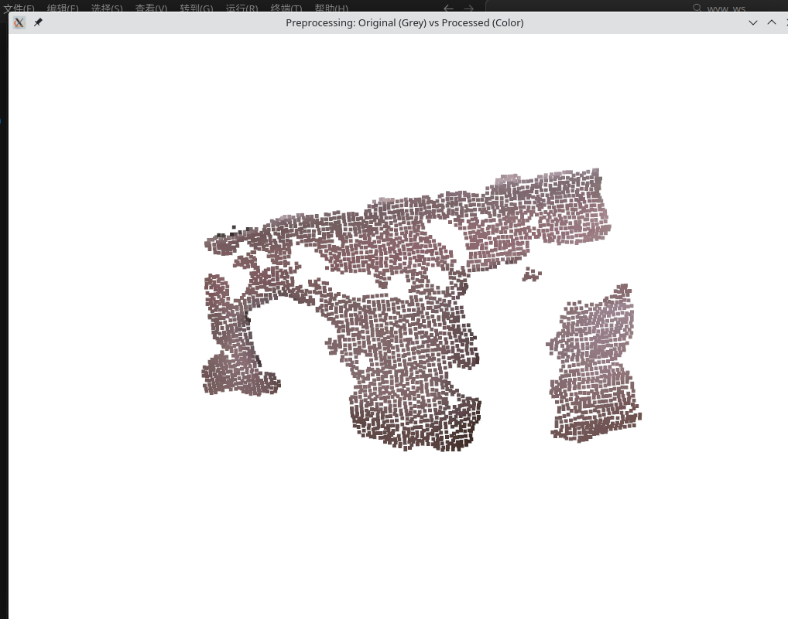
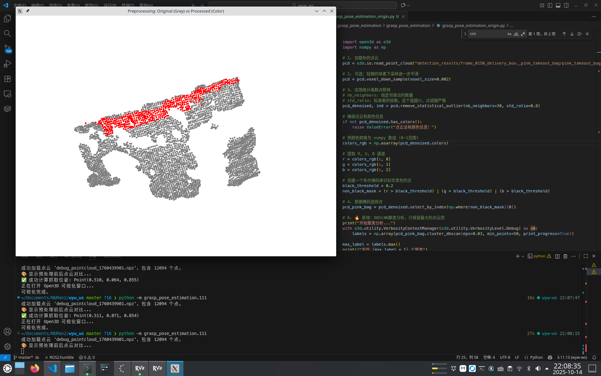
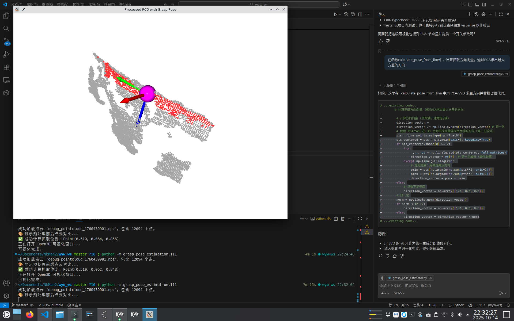
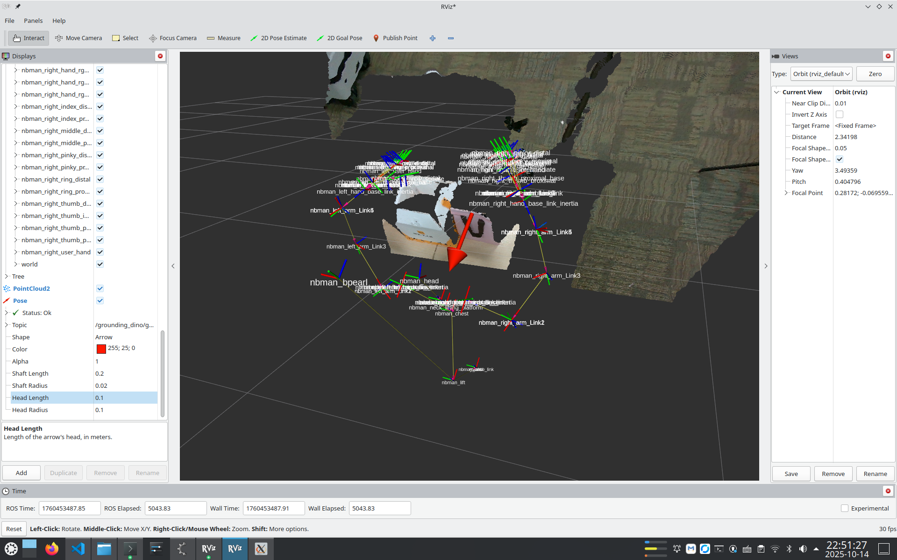

# Grasp Pose Estimation（抓取位姿估计）

基于视觉的机器人抓取位姿估计系统，使用 GroundingDino + Segment Anything 进行目标检测与分割，并计算物体的抓取位姿。

## 项目概述

本项目实现了一个完整的抓取位姿估计流水线：

1. **目标检测**：使用 GroundingDino 和 SAM (Segment Anything Model) 进行开集目标检测
2. **点云提取**：从 RGBD 图像中提取目标物体的 3D 点云
3. **位姿计算**：基于点云数据计算物体的抓取位姿
4. **位姿发布**：在 ROS2 中发布抓取位姿供机器人使用

### 抓取位姿定义

- **Y 轴**：指向物体线段方向（抓取方向）
- **Z 轴**：从物体上方指向竖直下方（从上往下抓取）
- **X 轴**：通过右手定则确定

### 处理流程示意图

详细的处理过程可参考 `Figure/` 文件夹中的图片：

- 

- 
- 
- 
- 

---

## 核心文件说明

### 1. `groundedSAM_based_edge_estimation_node.py` - 主节点

ROS2 主节点，负责整合视觉检测和抓取计算的完整流程。

**核心类：`GroundingDinoROS2Node`**

#### 主要功能
- 订阅 RGB 和深度图像话题
- 调用 GroundingDino+SAM 检测并分割目标物体
- 提取目标物体的 3D 点云（带颜色信息）
- 调用抓取位姿估计器计算抓取位姿
- 发布抓取位姿到 `/grounding_dino/grasp_pose` 话题

#### 构造函数参数

```python
GroundingDinoROS2Node(
    node_name="grounding_dino_detector",           # ROS2 节点名称
    detection_prompt="delivery box. pink takeout bag",  # 检测目标的文本描述（用 . 分隔多个类别）
    confidence_threshold=0.4,                      # 检测置信度阈值（0-1）
    camera_intrinsics=None,                        # 相机内参字典 {"fx", "fy", "cx", "cy"}
    enable_image_visualization=True,               # 是否显示 2D 检测结果窗口
    enable_pointcloud_visualization=False,         # 是否显示 3D 点云处理窗口
    target_id_in_prompt=1                          # 目标物体在 prompt 中的索引（从 0 开始）
)
```

**参数说明：**
- `detection_prompt`：用句号分隔多个检测目标，例如 `"delivery box. pink takeout bag"` 表示检测两类物体
- `target_id_in_prompt`：指定用于计算抓取位姿的目标类别索引。例如值为 `1` 表示选择 "pink takeout bag"
- `enable_image_visualization`：建议在调试时打开，可以看到检测框和分割结果
- `enable_pointcloud_visualization`：打开后会显示点云处理（`GraspPoseEstimator`类）的每个步骤（较慢，仅调试时使用）
- `camera_intrinsics`：内参矩阵，必须指定
- `target_id_in_prompt`：目标物体在 prompt 中的索引（从 0 开始），必须指定

#### 订阅话题
- `/nbman/camera/nbman_head_rgbd/color/image_raw` - RGB 图像
- `/nbman/camera/nbman_head_rgbd/aligned_depth_to_color/image_raw` - 对齐的深度图像

#### 发布话题
- `/grounding_dino/grasp_pose` (PoseStamped) - 抓取位姿（在 `nbman_base_link` 坐标系下）

- `/grounding_dino/debug_pointcloud` (PointCloud2) - 调试用点云（已经删除不再发布）

  

**注意：**`self.robot_base_frame = 'nbman_base_link' `和` self.camera_frame = 'nbman_head_rgbd_color_optical_frame' `这两个参数已经在构造函数中硬编码，注意是否需更改。

#### 内部类：`AdvancedGroundingDinoProcessor`

这是 `GroundingDinoROS2Node` 内部使用的视觉处理器类，目标检测和分割功能在这实现。

##### 主要功能
- 加载和管理 GroundingDino 和 SAM 模型
- 执行基于文本提示的开集目标检测
- 使用 SAM 对检测框进行精确分割
- 从 RGBD 图像中提取目标物体的 3D 点云
- 可视化检测结果（2D 图像标注）

##### 构造函数参数

```python
AdvancedGroundingDinoProcessor(
    grounding_dino_config_path="...",              # GroundingDino 配置文件路径
    grounding_dino_checkpoint_path="...",          # GroundingDino 模型权重路径
    sam_encoder_version="vit_h",                   # SAM 编码器版本
    sam_checkpoint_path="...",                     # SAM 模型权重路径
    box_threshold=0.35,                            # 检测框置信度阈值（0-1）
    text_threshold=0.25,                           # 文本匹配置信度阈值（0-1）
    nms_threshold=0.5,                             # 非极大值抑制阈值（0-1）
    device="cuda"                                  # 计算设备（"cuda" 或 "cpu"）
)
```

**参数说明：**
- `box_threshold`：检测框的置信度阈值，值越高筛选越严格
- `text_threshold`：文本与图像匹配的置信度阈值，值越高要求匹配度越高
- `nms_threshold`：用于去除重叠检测框，值越小保留的框越少
- `device`：建议使用 "cuda" 以获得更快的推理速度（需要 GPU 支持）

**注意：** 通常用户不需要直接实例化这个类，它会在 `GroundingDinoROS2Node` 初始化时自动创建，**这个类的构造参数通常也无需修改**。

---

### 2. `grasp_pose_estimator.py` - 抓取位姿估计器

实现从点云到抓取位姿的计算逻辑。

**核心类：`GraspPoseEstimator`**

#### 主要功能
- 点云预处理（滤波、聚类、去噪）
- 检测物体边缘线段
- 使用 RANSAC 算法拟合 3D 直线
- 计算抓取中心点和方向

#### 构造函数参数

```python
GraspPoseEstimator(
    voxel_size=0.002,                              # 体素下采样大小（米）
    stat_outlier_neighbors=30,                     # 统计离群点检测的邻居数
    stat_outlier_std_ratio=0.8,                    # 统计离群点标准差倍数
    dbscan_eps=0.03,                               # DBSCAN 聚类半径（米）
    dbscan_min_points=50,                          # DBSCAN 最小聚类点数
    final_stat_outlier_std_ratio=0.5,              # 最终清理的离群点标准差倍数
    final_radius_outlier_nb_points=20,             # 半径离群点检测的邻居数
    final_radius_outlier_radius=0.02,              # 半径离群点检测的半径（米）
    edge_candidate_tolerance=0.020,                # 边缘候选点深度容差（米）
    ransac_residual_threshold=0.010,               # RANSAC 内点距离阈值（米）
    black_threshold=0.2,                           # 黑色滤除阈值（0-1）
    visualize=False                                # 是否可视化处理过程
)
```

**参数说明：**
- `voxel_size`：越小保留越多细节，但计算越慢。建议 0.001-0.005
- `dbscan_eps`：聚类半径，应根据物体尺寸调整。较大值会将多个物体聚为一类
- `edge_candidate_tolerance`：检测边缘的深度范围。较大值会包含更多点，但可能不准确
- `ransac_residual_threshold`：线段拟合的严格程度。越小拟合越精确但可能失败
- `visualize`：打开后会显示预处理前后对比图和最终抓取位姿（需要人工关闭窗口）

---

### 3. `test_for_grasp_pose.py` - 单独测试脚本

用于离线测试抓取位姿计算，无需运行 ROS2 节点。

#### 使用方法

1. 准备点云数据文件（`.npz` 格式，以`"debug_pointcloud_1760439901.npz"`为例），包含：
   - `points`: (N, 3) 的点云坐标数组
   - `colors`: (N, 3) 的颜色数组（RGB, 0-255）

2. 修改脚本中的文件路径：
   ```python
   file_name = 'debug_pointcloud_1760439901.npz'
   ```

3. 直接运行脚本：
   ```bash
   python3 test_for_grasp_pose.py
   ```

4. 脚本会显示点云和计算出的抓取位姿

---

## 安装依赖

### Python 依赖

已经安装好在./.venv/文件夹中，如果是迁移到一个新环境的话，按照如下方法安装
```python
# groundingDino对torch版本要求较低，手动安装torch，groundingdino的requirements.txt一定不能有torch一栏
uv pip install torch==2.3.1 torchvision==0.18.1 torchaudio==2.3.1
# 然后手动编译Grounding DINO和Segment Anything
export AM_I_DOCKER=False
export BUILD_WITH_CUDA=False
pip install --no-build-isolation -e GroundingDINO
python -m pip install -e segment_anything
# 手动安装ultralytics


```


### GroundingDino 和 SAM 模型

需要下载预训练模型并放置在 `non_ros_pkg/Grounded-Segment-Anything/` 目录下：

- `groundingdino_swint_ogc.pth` - GroundingDino 模型权重
- `sam_vit_h_4b8939.pth` - SAM 模型权重
- `GroundingDINO/` - GroundingDino 配置文件目录

---

## 使用方法

### 1. 启动主节点

```bash
# 编译 ROS2 工作空间
快捷键ctrl+shift+B

# Source ROS环境和python环境
rr
source ./.venv/bin/activate

# 启动节点
ros2 launch grasp_pose_estimation grasp_pose_estimation.launch.py
```

### 2. 查看发布的抓取位姿

```bash
# 查看话题
ros2 topic echo /grounding_dino/grasp_pose

# 在 RViz 中可视化
ros2 run rviz2 rviz2
# 添加 PoseStamped 显示，订阅 /grounding_dino/grasp_pose
```

---

## 输出坐标系

- **输入坐标系**: `nbman_head_rgbd_color_optical_frame` (相机光学坐标系)
- **输出坐标系**: `nbman_base_link` (机器人基座坐标系)
- 节点内部使用 TF2 自动完成坐标变换

---

## 服务版本
### 运行命令
运行基于YOLO的抓取位姿检测服务端，根据客户端指定的抓取类型—— **（边缘 / 提手）** ，服务器会返回 **（边缘 / 提手）** 抓取位姿，并且发布  **（边缘 / 提手）** 的TF变换和话题。
```python
ros2 launch grasp_pose_estimation yolo_edge_or_handle.launch.py
```
```yaml
TF Frame: 
edge_grasp_food_pos
handle_grasp_food_pos
Topic: 
'/food_detection/edge_grasp_pose' 
'/food_detection/handle_grasp_pose'
```
客户端运行命令
进入wrp_ws工作空间
```python
ros2 launch operation_library operation_library.launch.py 
```
新建终端运行
```python
# 边缘检测
ros2 topic pub /action_planner/action_command std_msgs/msg/String "data: 'locate_food'" --once
#提手检测
ros2 topic pub /action_planner/action_command std_msgs/msg/String "data: 'locate_food_handle'" --once
```


